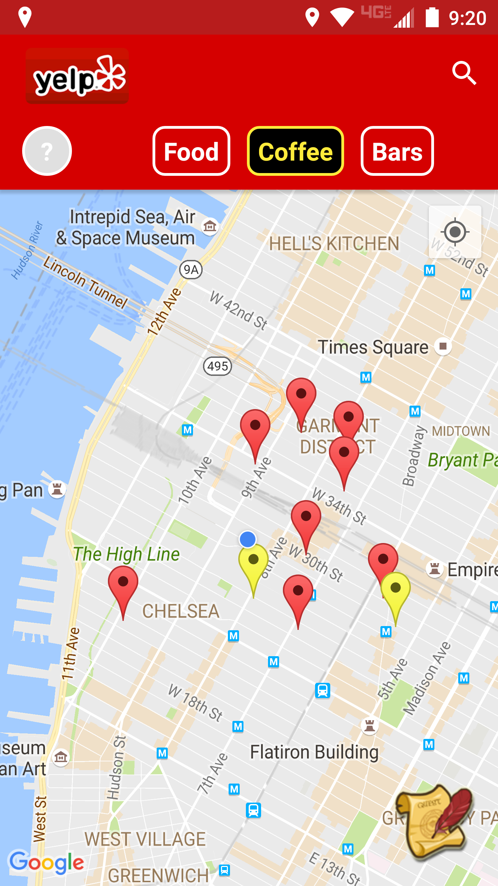

## Intro

A group project with classmates utilizing Google Map, Twitter, NY Times, and Yelp API's. The basic concept of the app is to allow users to go on quests and help them explore the city and try out new things. Rather than having to plan out everything when you visit a new city, you can use the app and let the quests guide you. Already lived in the city for many years? Use the app to explore parts of the city you haven't been to before. This app is still a work in progress. NOTE: You need to generate your own api keys to use this app.

## Instructions for Use:

- Tap search icon to search for anything, app will return 10 related businesses close to the current user position and add a marker.
- Tap the "Food," "Coffee," and "Bars" icons to quicklt search for 10 related businesses.
- Tap a marker on the map to show a sneek peek of the bottom sheet with minor details about the business.
- Tap the peeking bottom sheet to expand the entire height showing extended business details including the address, review and NY Times articles.
- Tap the Quest Button to open a popup where you can enter information to start a quest.
- In quest mode, tapping the markers while you are within 8ft of the GPS location will allow you to complete the quest node.
- After tapping "Complete Quest," a Twitter button will appear where you can send a tweet after authentication.
- Tap the "X" button to abandon quest.
- Back on the main screen, when you enter a search term there is a chance yellow markers will show up, these indicate completed quest locations, tap the "?" to toggle between showing the completed nodes or not.

## Screenshots

